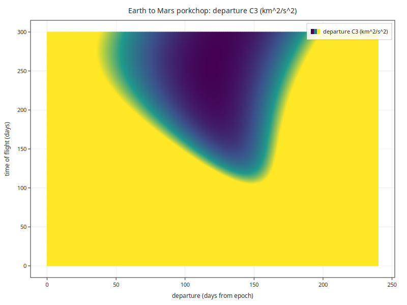

<div align="center">

# KFL

**A small language for artifact-producing batch programs.**

[](LICENSE)


*Compute&nbsp;→&nbsp;stdout&nbsp;&nbsp;·&nbsp;&nbsp;Plots&nbsp;→&nbsp;PNG/SVG&nbsp;&nbsp;·&nbsp;&nbsp;Simulations&nbsp;→&nbsp;observations*

</div>

KFL is a small programming language for writing artifact-producing batch
programs. A KFL program compiles to a standalone executable that, when run,
emits reproducible files or text — a table of numbers, a publication figure,
or the observations of a physical simulation. There is no interactive runtime
and no windowing: a program's output *is* its result.

The language ships with a scientific library suite — orbital mechanics,
ephemerides, N-body gravitation, curve fitting, numerical quadrature and ODE
integration, geomagnetic and atmosphere models, and a plotting engine — so
that a single self-contained `.kfl` file can carry a real computation from
first principles to a finished artifact.

<div align="center">

<br>
<sub><b>An Earth-to-Mars launch-window porkchop</b> — departure energy (C3) across a
departure / time-of-flight grid, solved from Lambert's problem. A complete
program in <a href="kflc/examples/porkchop.kfl"><code>kflc/examples/porkchop.kfl</code></a>,
depending only on the plotting and computation libraries.</sub>
</div>

## The three kinds of program

A KFL program is one of three shapes, distinguished only by what it emits:

- **Compute** — functions plus a `run` entry point that `print`s results to
  standard output.
- **Plot** — `fn data` producers feeding `plot` declarations that render PNG
  and SVG figures.
- **Simulation** — one or more `fn world` blocks that build a physical world,
  step it, and `observe` it, printing the observations.

A minimal compute program:

```
form HELLO
    fn double period_years(double a_au)
        return sqrt(a_au * a_au * a_au)   # Kepler's third law, mu = 4 pi^2
    end
    fn void run()
        print "Earth period = ", period_years(1.0), " yr"
        print "Mars  period = ", period_years(1.5237), " yr"
    end
end
```

```
kflc hello.kfl -o hello && ./hello
Earth period = 1 yr
Mars  period = 1.88083 yr
```

## Documentation

- **[Getting started](docs/getting-started.md)** — build and run the three
  kinds of program.
- **[Language reference](kflc/GRAMMAR.md)** — the complete KFL grammar.
- **[Scientific library reference](docs/libraries.md)** — the library suite
  and its KFL builtin surface.
- **[Examples](kflc/examples/)** — runnable programs for every language
  feature, each with its build line in the header comment.

## Installation

Each path below builds the distribution from this source tree and then
installs through the named packaging format. Pre-built binaries are not
currently published to public package repositories.

### Direct from source

```
make
sudo make install                   # default PREFIX=/usr/local
```

Override the install layout via environment variables on the `make install`
invocation:

```
make install PREFIX=/usr LIBDIR=/usr/lib/x86_64-linux-gnu DESTDIR=staging
```

The Debian package build sets `LIBDIR` to the multi-arch path automatically;
manual builds default to `$PREFIX/lib`.

### Debian, Ubuntu (.deb)

```
make deb
sudo apt install ./dist/debs/*.deb
```

`make deb` produces a set of binary packages under `dist/debs/`: the `kflc`
compiler, runtime libraries, and development headers. `apt install` resolves
inter-package dependencies in the correct order.

### Alpine Linux (apk)

An APKBUILD is provided under `apk/` for each shipped package. To build them
on an Alpine host:

```
for d in apk/*/; do (cd "$d" && abuild -r); done
```

The resulting `.apk` files land in the abuild output directory (typically
`~/packages/`).

### Homebrew (macOS), RPM (Fedora, RHEL)

Packaging scaffolds are present at `packaging/brew/` and `packaging/rpm/`.
Both carry their own `README.md` describing the current state of the formula
and spec; the `make brew` and `make rpm` targets surface those READMEs.
Neither is a supported build path.

## Compiling a KFL program

`kflc program.kfl -o program` compiles to a native executable. The compiler
emits C++ and invokes the system `c++` to produce the binary; a program that
uses a KFL library links it through `KFLC_LDLIBS`, and adds include and
library search paths through `KFLC_CFLAGS`:

```
# a plotting program (links the plotting + computation libraries)
KFLC_LDLIBS="-lk26plot -lk26compute -lk26m3d -lcairo -lm" \
    kflc kflc/examples/orbital_mechanics.kfl -o orbital_mechanics
./orbital_mechanics                 # writes p_inner.png, p_speed.png, ...
```

The header comment of each example under `kflc/examples/` lists its exact
build line.

## Build requirements

### Required

- C compiler: GCC 9 or later, or Clang 12 or later; a C++11 compiler (invoked
  by `kflc` to build the programs it emits).
- GNU make.
- A glibc-based host for direct source and Debian builds; musl is supported
  through Alpine `abuild` (see Alpine section).

### Optional

- `gfortran`: required to build the Fortran-backed scientific libraries
  (`libk26astro_quad`, `libk26astro_ode`, `libk26astro_geomag`,
  `libk26astro_atmos`). Builds skip cleanly when `gfortran` is absent.
- `libcairo2-dev`: required to build `libk26plot` and to link plotting
  programs.
- libcurl development headers: required to build `libk26http`. Builds skip
  cleanly when libcurl headers are absent.

## Build phases

The top-level Makefile orchestrates four phases in topological order:

1. **bedrock**: `libk26m3d`, `libk26compute`, `libk26tick`.
2. **aux**: `libk26plot`, `libk26geo`, and `libk26http` where libcurl headers
   are available.
3. **astro**: `libk26astro_core`; then the Tier 1 libraries (`ephem`, `body`,
   `conics`, `grav`, `fit`, `vehicle`); then the Fortran-backed tier (`quad`,
   `ode`, `geomag`, `atmos`) where `gfortran` is available; finally the
   runtime manager `libk26astro_rt`.
4. **compiler**: `kflc`, the KFL compiler.

Each per-library Makefile is independently buildable; the top-level Makefile
enforces build order across the tree.

## Make targets

| Target             | Behaviour |
|--------------------|-----------|
| `make`             | Build everything in topological order. |
| `make test`        | Run unit and integration tests. |
| `make install`     | Install to `$DESTDIR$PREFIX` (default `/usr/local`). |
| `make uninstall`   | Manifest-driven removal of installed files. |
| `make deb`         | Build Debian binary packages under `dist/debs/`. |
| `make dist`        | Produce a source tarball. |
| `make clean`       | Remove per-library build outputs. |
| `make kfl-version` | Print `VERSION` and `KFL_GRAMMAR_VERSION`. |

## License and attribution

Distributed under the MIT License — see [`LICENSE`](LICENSE). Third-party
attribution is summarised in [`NOTICE`](NOTICE), with the machine-readable
canonical record in `packaging/debian/copyright`. The bundled numerical
routines (QUADPACK, ODEPACK, CMINPACK, IGRF-14, NRLMSISE-00) retain their own
upstream licenses under each library's `src/upstream/` directory; all are
public-domain or permissive and compatible with MIT redistribution.
